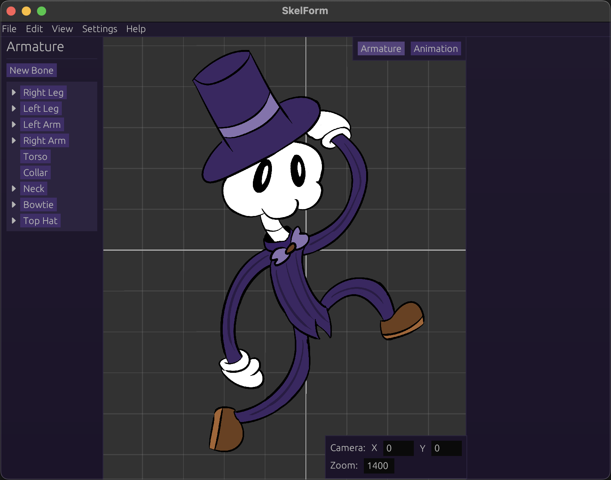

# SkelForm

SkelForm is a 2D animator, architecturally inspired by DragonBones and made in response to a lack of other free alternatives.

# Building

Install Rust v1.85.0 or above.

Then, run `cargo run` in the terminal.

## Web

Install [Trunk](https://trunkrs.dev) v0.21.7 or above, as well as Python (any version should do).

Then, run the `web_build.py` script to build the `dist` folder with the necessary files for web distribution.

Notable argument(s):
* `--serve` - Immediately run `localhost:8000` after build.

## Mobile

As of 26/05/25, mobile is not actively developed and does not have a direct build process.

However, it can be easily done with the web version in a simple WebView wrapper (eg [Capacitor](https://capacitorjs.com/)).

Check out the [example repo](https://github.com/Retropaint/skelform_mobile).

The web build script provides a `--mobile` flag for a typical mobile dist config.

# Documentation

Run `cargo doc --no-deps --open`

This will open a local docs.rs page.

As of 05/05/2025, proper documentation is still sparse. Until then, enjoy comment hunting!

[User documentation](https://retropaint.github.io/skelform_user_docs/) is hosted separately.

# Acknowledgements

This project was built on top of [matthewjberger/wgpu-example](https://github.com/matthewjberger/wgpu-example).
