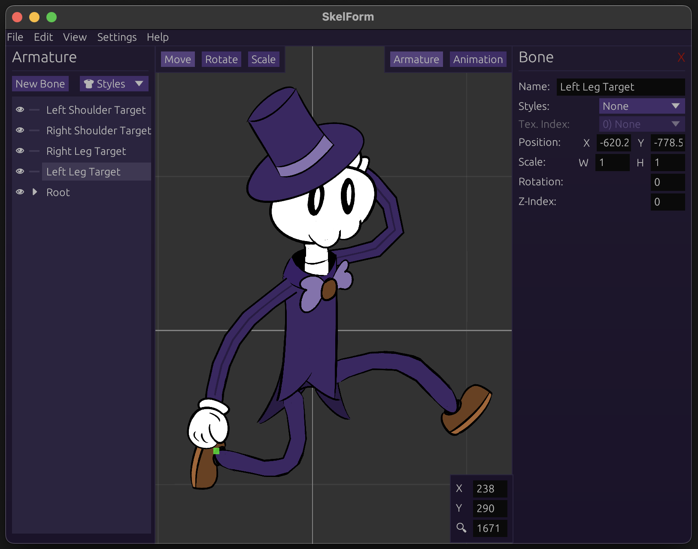

# SkelForm

SkelForm is a 2D skeletal animator, designed for games.

[skelform.org](https://skelform.org)

# Building

Install Rust v1.85.0 or above.

Then, run `cargo run` in the terminal.

## Web

Install [Trunk](https://trunkrs.dev) v0.21.7 or above, as well as Python 3.13.6
or above.

Then, run the `web_build.py` script to build the `dist` folder with the
necessary files for web distribution.

Notable argument(s):

- `--serve` - Immediately run `localhost:8000` after build.
- `--release` - Builds for release. Requires changing base url to test locally.

## Mobile

As of 26/05/25, mobile is not actively developed and does not have a direct
build process.

However, it can be easily done with the web version in a simple WebView wrapper
(eg [Capacitor](https://capacitorjs.com/)).

Check out the [example repo](https://github.com/Retropaint/skelform_mobile).

The web build script provides a `--mobile` flag for a typical mobile dist
config.

## Native Desktop Release

Check out the `release` folder for building native releases.

# Documentation

Run `cargo doc --no-deps --open`

This will open a local docs.rs page.

Editor documentation is still sparse. Please check out

- [User documentation](https://skelform.org/user-docs) - Using the editor &
  runtimes as end-user
- [Dev documentation](https://skelform.org/dev-docs) - Runtime development (from
  scratch & integrating)

# Acknowledgements

This project was built on top of
[matthewjberger/wgpu-example](https://github.com/matthewjberger/wgpu-example).
